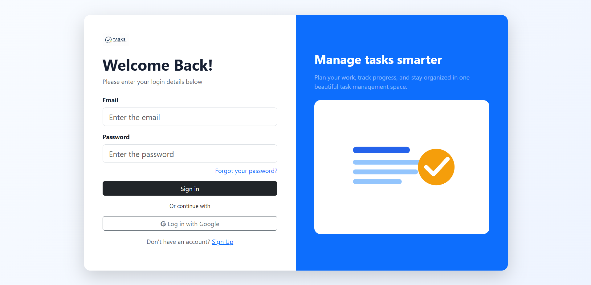
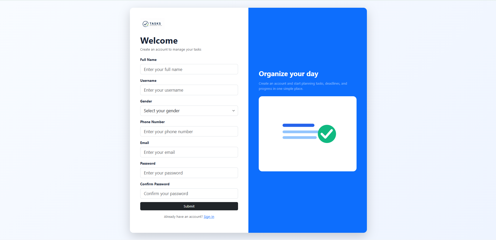
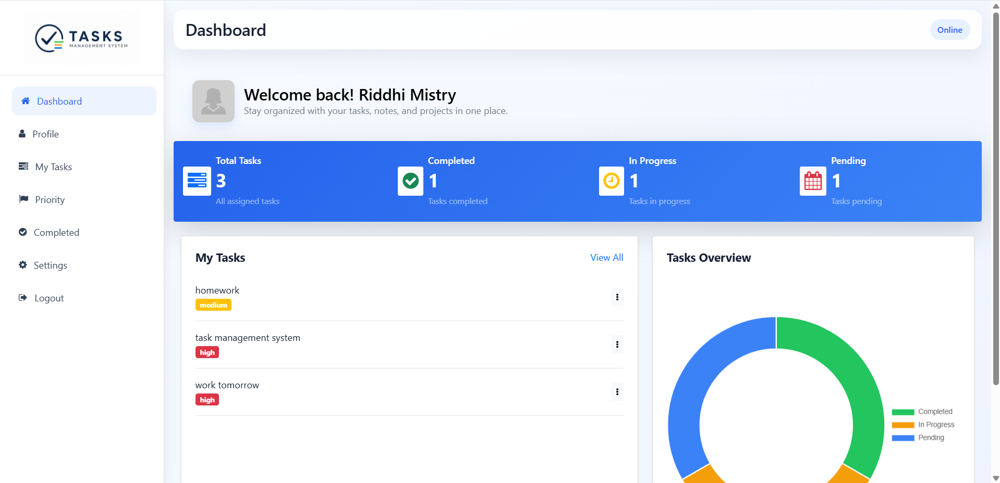

# 📋 Tasks_Mangement_System_task4

A responsive **Task Management System** developed using **HTML5, CSS3, JavaScript, Bootstrap 5**, and a REST API. The application helps users manage their daily tasks with features like authentication, profile management, task tracking, priority management, and a clean responsive dashboard.

---

## 📸 Project Screenshots

### 🔐 Login Page

> Add screenshot here



---

### 📝 Sign Up Page

> Add screenshot here



---

### 📊 Dashboard

> Add screenshot here



---

## ✨ Features

### 🔐 Authentication

- User Registration
- User Login
- User Logout
- Access Token Authentication
- Session Management

### 📊 Dashboard

- Welcome Dashboard
- Task Statistics
- Responsive Layout
- Desktop Sidebar
- Mobile Offcanvas Navigation

### ✅ Task Management

- Add New Task
- Update Existing Task
- Delete Task
- Mark Task as Completed
- View Completed Tasks
- Task Priority Management

### 👤 Profile

- View Profile
- Update Personal Information
- Upload Profile Picture
- Remove Profile Picture
- Local Storage Support

### ⚙️ Settings

- Notification Preferences
- Theme Preferences
- Save User Preferences
- Reset Local Settings

### 🎨 User Experience

- Responsive Design
- Custom Popup Component
- Global Loading Spinner
- Bootstrap Offcanvas Navigation
- Font Awesome Icons
- Smooth Animations

---

## 🛠️ Technologies Used

### Frontend

- HTML5
- CSS3
- JavaScript (ES6)
- Bootstrap 5
- Font Awesome

### API

- REST API
- Fetch API

### Storage

- Local Storage

---

## 📂 Project Structure

```
Task_Management_System
│
├── CSS
│   └── style.css
│
├── dashboard
│   ├── dashboard.html
│   ├── my-tasks.html
│   ├── completed.html
│   ├── priority.html
│   ├── profile.html
│   ├── settings.html
│   ├── navbar.js
│   ├── tasks.js
│   ├── profile.js
│   ├── completed.js
│   └── settings.js
│
├── login
│   ├── login_page.html
│   └── login.js
│
├── sign up
│   ├── index.html
│   └── signup.js
│
├── Only_JS
│   ├── auth.js
│   ├── config.js
│   ├── loader.js
│   └── popup.js
│
├── images
│   ├── logo.png
│   ├── login-page.png
│   ├── signup-page.png
│   └── dashboard-page.png
│
├── index.html
└── README.md
```

---

## 🚀 Main Modules

| Module | Description |
|---------|-------------|
| Login | Authenticate registered users |
| Registration | Create a new user account |
| Dashboard | Overview of user tasks |
| My Tasks | View and manage all tasks |
| Completed | Display completed tasks |
| Priority | Filter tasks by priority |
| Profile | Update user information |
| Settings | Manage application preferences |

---

## 📱 Responsive Design

The application is fully responsive and supports:

- 💻 Desktop
- 💼 Laptop
- 📱 Mobile
- 📟 Tablet

### Navigation

- Desktop → Fixed Sidebar
- Mobile → Bootstrap Offcanvas Sidebar

---

## 🌐 API

**Base URL**

```
https://intern-crud-task-api.onrender.com/api
```

---

## ▶️ How to Run

### 1. Clone Repository

```bash
git clone https://github.com/your-username/Task_Management_System.git
```

### 2. Open Project

Open the project folder in **Visual Studio Code**.

### 3. Run

Open **index.html** in your browser.

---

## 💡 Highlights

- Responsive UI
- Modular JavaScript
- Reusable Components
- Dynamic Navbar
- Custom Popup
- Loading Spinner
- Clean Code Structure
- Local Storage Support
- REST API Integration
- Mobile Friendly

---

## 📈 Future Improvements

- Dark Mode
- Calendar View
- Search Tasks
- Task Categories
- Due Date Notifications
- Drag & Drop Tasks
- Team Collaboration
- File Attachments

---

## 👨‍💻 Author

**Riddhi Mistry**

B.E. Computer Science & Engineering

Frontend Web Developer

---

## 📄 License

This project is developed for educational and internship purposes.

---

⭐ If you found this project helpful, consider giving it a **Star** on GitHub.
